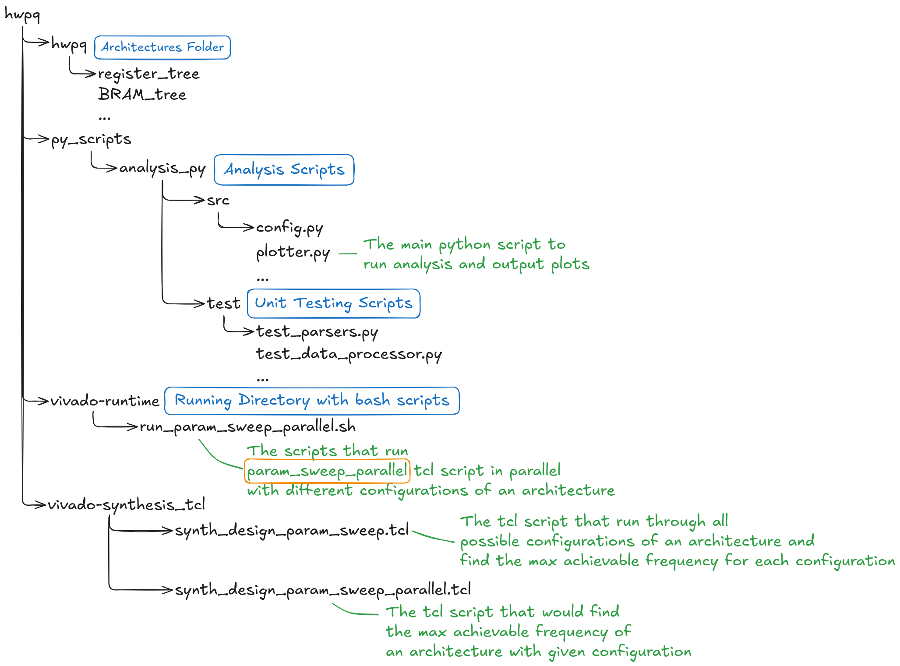

# Hardware Priority Queue Architecture Library


🎯 This library serves as a comprehensive resource for hardware researchers and developers exploring **hardware priority queues for high-performance computing applications**.

<!-- It enables straightforward comparison of various architectural approaches published in literature, supporting critical use cases such as task scheduling, event simulation, network packet processing, and real-time systems. -->

<!-- This project presents a comprehensive evaluation of hardware priority queue architectures, focusing on their performance, resource utilization, and scalability in modern FPGA implementations. We analyze various architectures proposed in the past decades, including register tree, register array, systolic array, BRAM tree, and hybrid tree designs, under different configurations and queue sizes. Our study provides insights into architectural trade-offs and helps researchers choose the most suitable design for their specific requirements. To support reproducibility and further research, we provide this open-source library containing parameterized RTL implementations of each architecture, along with synthesis and analysis scripts compatible with [Xilinx Vivado](https://www.amd.com/en/products/software/adaptive-socs-and-fpgas/vivado.html). -->

<!-- ## Overview -->

<!-- In typical software implementations, a priority queue is often realized using a binary heap. During an enqueue operation, the new item is inserted at the leftmost available position in the heap and may then be repeatedly swapped with its parent node (a process known as heapify-up) to restore the heap property. Conversely, a dequeue operation retrieves the maximum/minimum element from the root and replaces it with the rightmost non-empty node at the last level. This displaced element is then propagated downward (heapify-down), repeatedly compared with its children until it reaches its correct position in the tree. Both enqueue and dequeue operations have a worst-case time complexity of $O(log\ N)$, as an element may need to traverse the height of the binary tree to maintain the heap structure. -->

<!-- **By implementing the priority queue in hardware, we can leverage the inherent parallelism of FPGAs to perform compare-and-swap operations concurrently across different levels of the data structure, achieving constant-time operation in ideal scenarios.** -->

<!-- ## Methodology -->

<!-- To ensure uniform testing across all architectures, we developed a **standardized interface** that encapsulates each implementation, enabling seamless integration with a unified testbench. This interface facilitated a consistent verification environment to validate the functionality of all modules, ensuring support for the core operations: **enqueue**, **dequeue**, and **replace**. -->

<!-- Following functional verification using a suite of RTL testbenches, each priority queue architecture was synthesized and implemented using AMD Vivado. A parameter sweep was conducted to evaluate how different design factors influence performance and resource utilization. The parameters explored included queue size, support for the enqueue operation, and the use of pipelining. -->

<!-- [The AMD Artix UltraScale+ FPGA (XCAU25P)](https://www.amd.com/en/products/adaptive-socs-and-fpgas/fpga/artix-ultrascale-plus.html) was selected as the test platform due to its ample availability of LUTs, FFs, and BRAMs. This resource-rich environment helped mitigate the impact of hardware limitations, allowing for a more accurate assessment of architectural scalability and efficiency. **Users of this library are free to switch to any other platform by changing the relevant parameters in the Tcl scripts; the step-by-step method is described below.** -->

<!-- As a result, observed performance bottlenecks and scalability constraints were attributed primarily to architectural design choices rather than hardware shortages.  -->

<!-- For each configuration, we measured the **maximum achievable operating frequency** and recorded resource consumption in terms of **lookup tables (LUTs)**, **flip-flops (FFs)**, and **block RAMs (BRAMs)**. These measurements enabled us to evaluate both performance and resource efficiency relative to the targeted throughput. -->

<!-- ## How to Use -->

## Project Structure



- `hwpq/` - Contains RTL implementations of different priority queue architectures, along with **pre-collected key metrics logs**.
- `py-scripts/` - Python scripts for data analysis and visualization.
- `vivado-runtime/` - Contains shell scripts that run Vivado in Tcl mode to sweep through parameters of each architecture in parallel.
  - It is suggested that users execute any Tcl or Bash scripts inside this directory. Since Vivado generates log and journal files automatically, keeping them in this specific directory facilitates later access and debugging.
- `vivado-synthesis_tcl/` - Tcl scripts for Vivado synthesis.

## Prerequisites

Before running the synthesis and analysis, ensure you have the following installed:

- **Xilinx Vivado**: 2024.2 preferred
  - Download here: https://www.xilinx.com/support/download.html
- **Python 3**: verison>=3.8 preferred

## Running Synthesis and Analysis

Re-running synthesis is not necessary as all data is already available within each architecture's directory. If you're interested in analyzing the existing results, please proceed directly to the Analysis section below. Only re-run synthesis if you've modified an architecture or wish to test with different parameters.

### Synthesis

1.  Clone the repository.
2.  Navigate to the `hwpq` directory:

    ```bash
    cd hwpq/vivado-runtime
    ```

3.  Execute the parameter sweep Bash script, this script would find sweep through all possible combinations of **enqueue swtich (if supported)**, **queue_size (you can change the range inside of the script)** with **data width set to 16 bits (change also be changed inside of the script)**:

    ```bash
    ./run_param_sweep_parallel.sh <architecture>
    ```

    - Aviable architectures:

      - register_tree
      - register_tree_pipelined
      - register_array
      - register_array_pipelined
      - systolic_array
      - bram_tree
      - bram_tree_pipelined
      - hybrid_tree

4.  Alternatively, if you just want to synthesize an architecture under a specific configurations, you could also run the tcl scipt instead:

    ```bash
    vivado -mode batch -source ../vivado-synthesis_tcl/synth_design_param_sweep_parallel.tcl -tclargs <architecture_name> <enqueue_on/off> <data_width> <queue_size>
    ```

    - **`<architecture_name>`**:
      - register_tree
      - register_tree_pipelined
      - register_array
      - register_array_pipelined
      - systolic_array
      - bram_tree
      - bram_tree_pipelined
      - hybrid_tree
    - **`<enqueue_on/off>`**: `1` (on) or `0` (off)
    - **`<data_width>`**: e.g., `8`, `16`, `32`, `64` (integer)
    - **`<queue_size>`**: architecture and application-dependent (integer)

### Analysis

1.  Navigate to the `hwpq` directory:

    ```bash
    cd hwpq/vivado-runtime
    ```

2.  Install the required Python packages:

    ```bash
    pip install -r ../py-scripts/requirements.txt
    ```

3.  Process and visualize the results using the Python plotting script:

    ```bash
    python ../py-scripts/analysis_py/src/plotter
    ```

## Current Support Priority Queue Architectures (Work in Progress)

### Register Based

#### [Register Tree](hwpq/register_tree/README.md)

#### [Register Tree Pipelined](hwpq/register_tree_pipelined/README.md)

#### [Register Array](hwpq/register_array/README.md)

#### [Register Array Pipelined](hwpq/register_array_pipelined/README.md)

#### [Systolic Array](hwpq/systolic_array/README.md)

### BRAM Based

#### [BRAM Tree](hwpq/bram_tree/README.md)

#### [BRAM Tree Pipelined](hwpq/bram_tree_pipelined/README.md)

#### [Hybrid Tree](hwpq/hybrid_tree/README.md)

## Reference

```
@article{moon2000,
  author = {Sung-Whan Moon and Rexford, J. and Shin, K.G.},
  journal = {IEEE Transactions on Computers},
  title = {Scalable hardware priority queue architectures for high-speed packet switches},
  year = {2000},
  volume = {49},
  number = {11},
  pages = {1215-1227},
  keywords = {Packet switching;Switches;Shift registers;Systolic arrays;Hardware design languages;Quality of service;Buildings;Binary trees;Clocks;Silicon compiler},
  doi = {10.1109/12.895938},
}
```

https://dl.acm.org/doi/10.1109/12.895938

```
@inproceedings{huang2014,
  author = {Huang, Muhuan and Lim, Kevin and Cong, Jason},
  booktitle = {2014 24th International Conference on Field Programmable Logic and Applications (FPL) },
  title = {A scalable, high-performance customized priority queue},
  year = {2014},
  volume = {},
  number = {},
  pages = {1-4},
  keywords = {Throughput;Field programmable gate arrays;Arrays;Registers;Clocks;Software;Database systems},
  doi = {10.1109/FPL.2014.6927413},
}
```

https://vast.cs.ucla.edu/sites/default/files/publications/Scalable%20high-performance%20CPQ_1.pdf

```
@article{zhou2020,
  author = {Zhou, Yuzhi and Jin, Xi and Wang, Tianqi and Boluda, Jose A.},
  title = {FPGA Implementation of A Star Algorithm for Real-Time Path Planning},
  year = {2020},
  issue_date = {2020},
  publisher = {Hindawi Limited},
  address = {London, GBR},
  volume = {2020},
  issn = {1687-7195},
  url = {https://doi.org/10.1155/2020/8896386},
  doi = {10.1155/2020/8896386},
  journal = {Int. J. Reconfig. Comput.},
  month = jan,
  numpages = {11},
}
```

https://dl.acm.org/doi/abs/10.1155/2020/8896386
