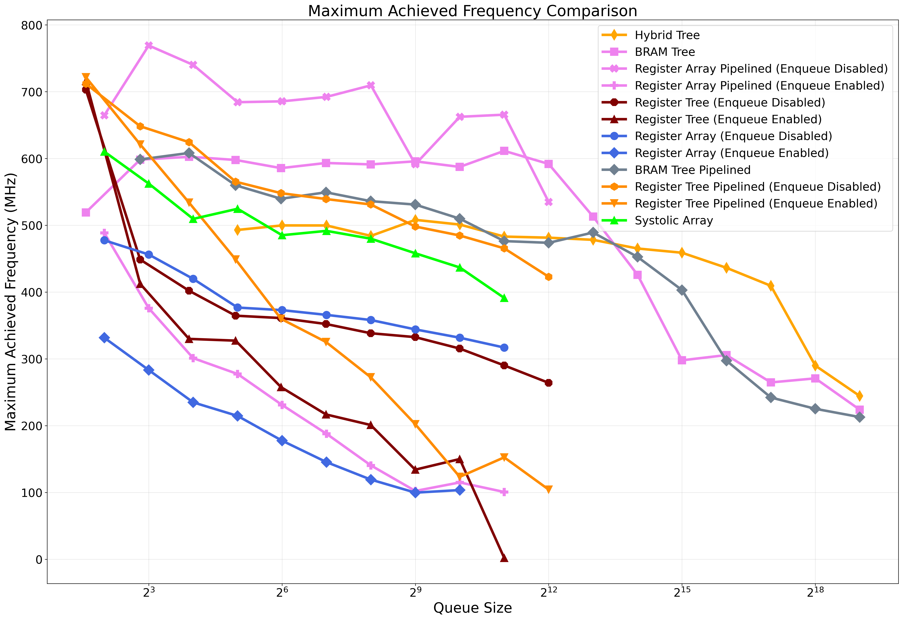
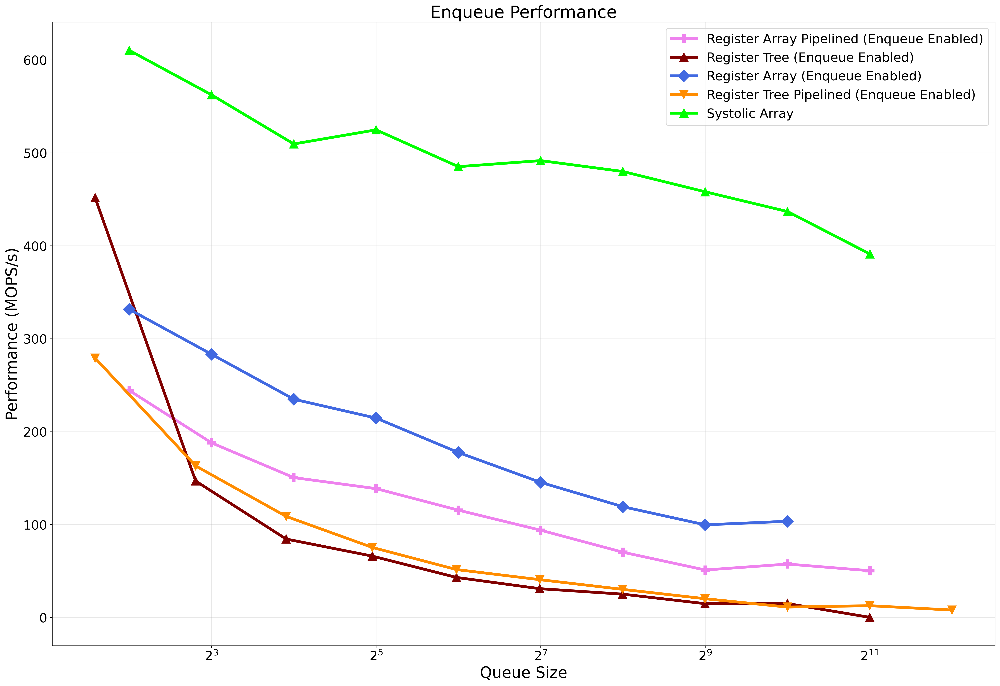
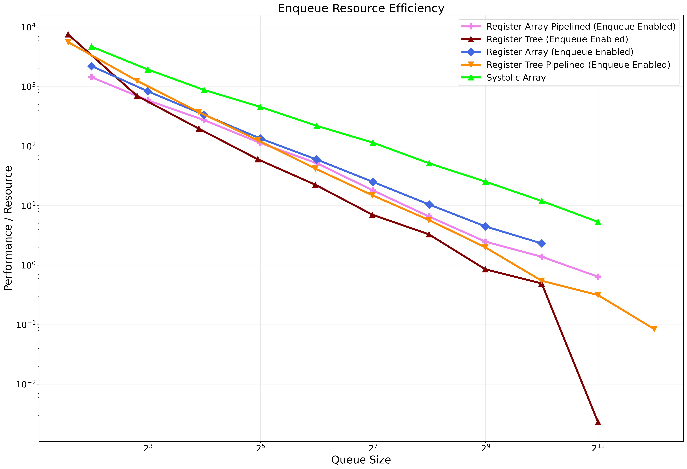
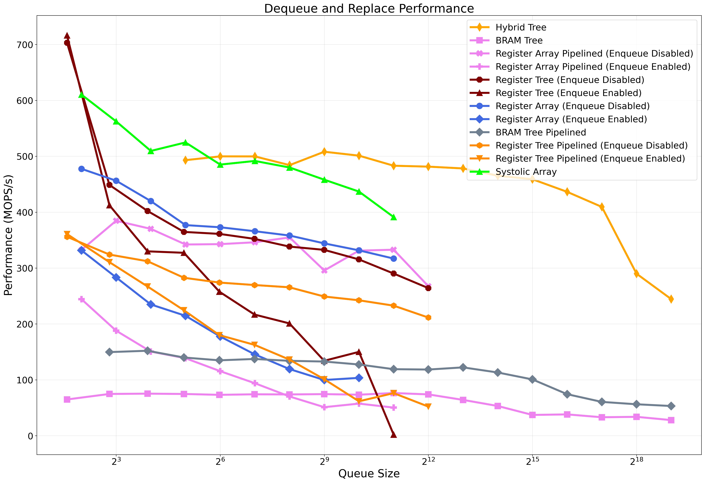
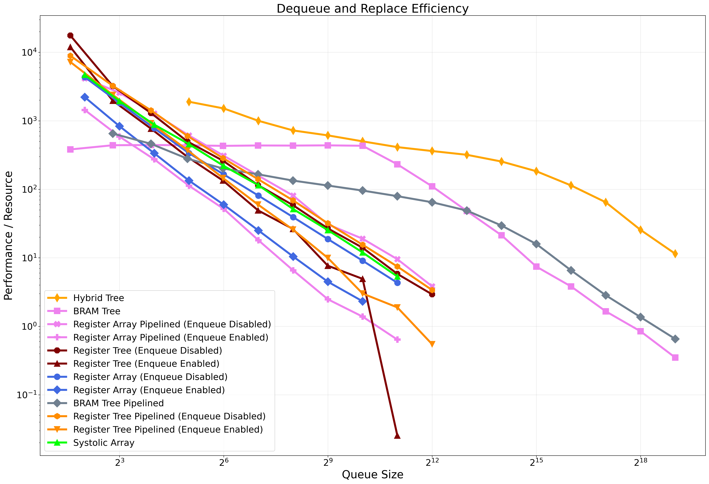
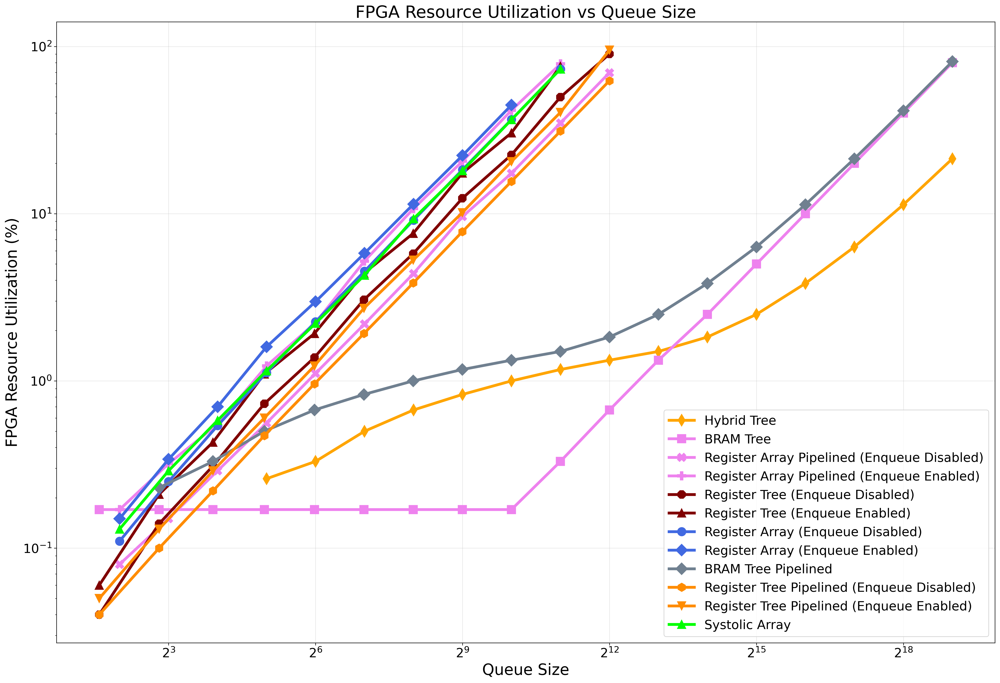
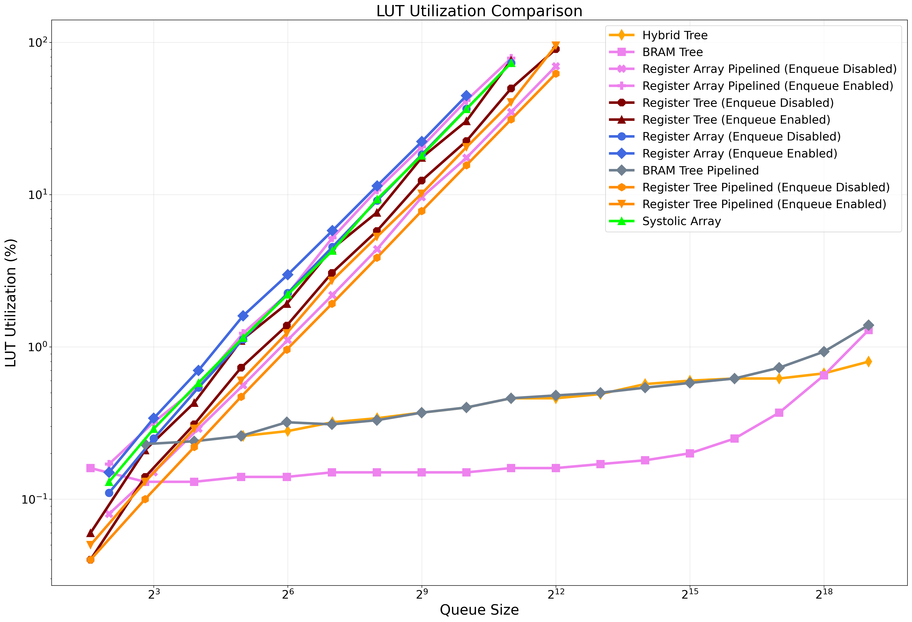
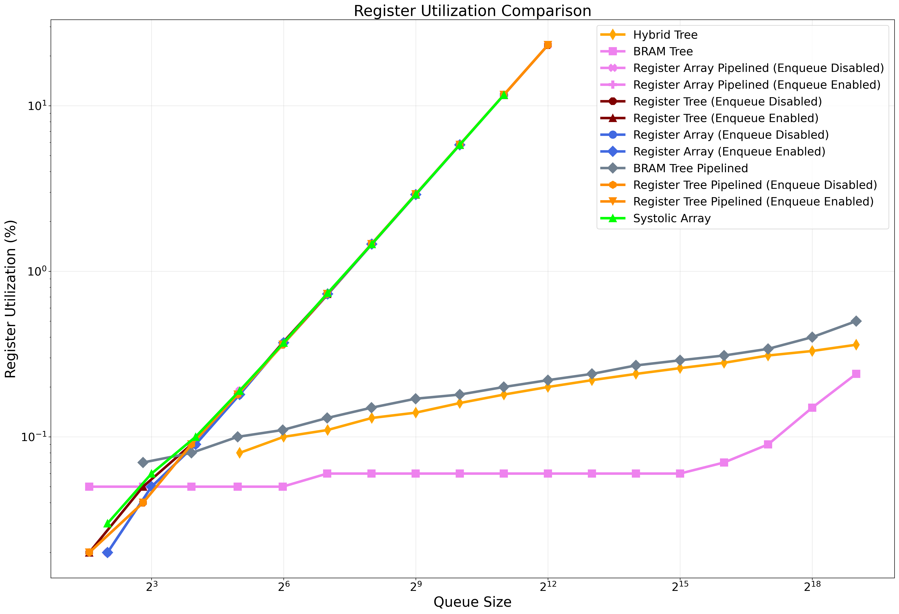
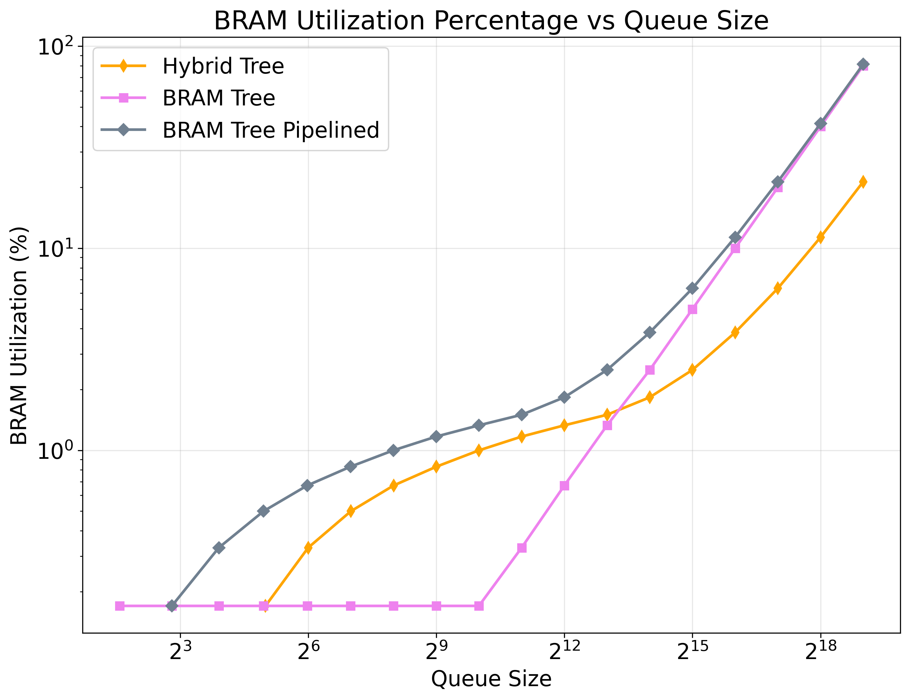

# Architecture Overviews

## Architecture Cross Comparison

| Architecture             | Enqueue Switch           | Enqueue Latency | Replace/Dequeue Latency |
| ------------------------ | ------------------------ | --------------- | ----------------------- |
| Register Array           | Yes                      | O(1)            | O(1)                    |
| Register Array Pipelined | Yes                      | O(2)            | O(2)                    |
| Register Tree            | Yes                      | O(log N)        | O(1)                    |
| Register Tree Pipelined  | Yes                      | O(log N)        | O(2)                    |
| BRAM Tree                | No                       | N/A             | O(8)                    |
| BRAM Tree Pipelined      | No                       | N/A             | O(4)                    |
| Hybrid Tree              | No (Working in Progress) | O(1)            | O(1)                    |
| Systolic Array           | Yes                      | O(N)            | O(1)                    |

## Register-based Implementations

### [Register Array](./register_array/README.md)

A simple implementation that stores priority queue elements in registers arranged linearly, performing sequential comparisons for queue operations. While conceptually straightforward, this approach offers limited scalability for larger queue sizes.

### [Register Array Pipelined](./register_array_pipelined/README.md)

An enhanced version of the register array that employs pipelining to divide comparison operations across multiple clock cycles, improving achievable clock frequency at the cost of increased latency.

### [Register Tree](./register_tree/README.md)

A heap-based implementation that closely resembles a software priority queue. Unlike software implementations that typically require $O(log\ N)$ time complexity, this hardware version achieves $O(1)$ time complexity for dequeue and replace operations through parallel compare-and-swap operations across the tree structure.

### [Register Tree Pipelined](./register_tree_pipelined/README.md)

A pipelined version of the register tree that splits the compare-and-swap logic between cycles, reducing combinational path lengths and allowing for higher clock frequencies.

## Memory-based Implementations

### [BRAM Tree](./bram_tree/README.md)

An implementation that leverages Block RAM (BRAM) for storing queue elements, reducing resource utilization compared to register-based approaches while increasing access latency.

### [BRAM Tree Pipelined](./bram_tree_pipelined/README.md)

A pipelined version of the BRAM tree architecture that improves throughput by breaking down one BRAM into mutiples that represent each depth of tree.

## Hybrid and Advanced Implementations

### [Hybrid Tree](./hybrid_tree/README.md)

A combined approach that utilizes both registers and memory elements, attempting to balance the performance advantages of registers with the resource efficiency of memory-based storage.

### [Systolic Array](./systolic_array/README.md)

A specialized architecture that employs a systolic array design pattern for highly parallel processing of priority queue operations, potentially offering superior throughput for specific workloads.

## Analysis Results

This section presents performance and resource utilization data comparing all priority queue architectures across various metrics, providing insights into design trade-offs.

Maximum achievable clock frequencies for each architecture, showing how pipelining improves timing performance.

Enqueue operation performance measured in operations per second, demonstrating throughput capabilities across different queue implementations.

Efficiency of enqueue operations normalized against resource utilization, highlighting designs that offer the best performance-to-resource ratio.

Replacement and dequeue operation performance in operations per second, showing how different architectures handle removal operations.

Efficiency of replacement and dequeue operations relative to resource consumption, identifying optimal designs for these critical operations.

Overall resource utilization comparison between implementations, providing a high-level view of hardware costs.

Detailed Look-Up Table (LUT) usage across architectures, showing combinational logic requirements.

Flip-flop utilization comparison, indicating register storage requirements for each implementation.

Block RAM utilization metrics, highlighting memory-based implementations and their resource efficiency.
