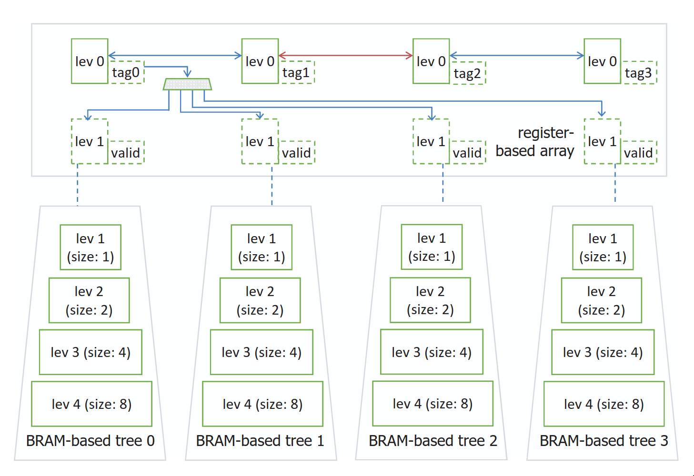

# Hybrid Tree

## Description

A Max H-PQ is a hybrid priority queue architecture that combines multiple BRAM-based trees with a register array responsible for sorting their root nodes. New items replace the leftmost register entry and propagate down the corresponding BRAM-tree to restore the heap property, while the register array is updated to maintain order. The design leverages parallelism by allowing multiple items to propagate through separate trees concurrently, effectively hiding the latency of individual BRAM accesses.

The Max H-PQ maintains two properties: (1) in the register array, each left node is greater than or equal to its right neighbor; (2) within each BRAM-tree, parent nodes are greater than or equal to their children. The register array is enhanced with metadata: a tree tag, a buffered level-1 node for fast local comparison, and a valid bit to manage synchronization with the BRAM-tree. After insertion, a two-step compare-and-swap operation restores register-array order.

To reduce communication and buffering overhead, each level $i$ of the BRAM-tree stores $2^{i-1}$ items instead of $2^i$, ensuring only one level-1 node is stored in the register array.

## Strcuture

## Performance

