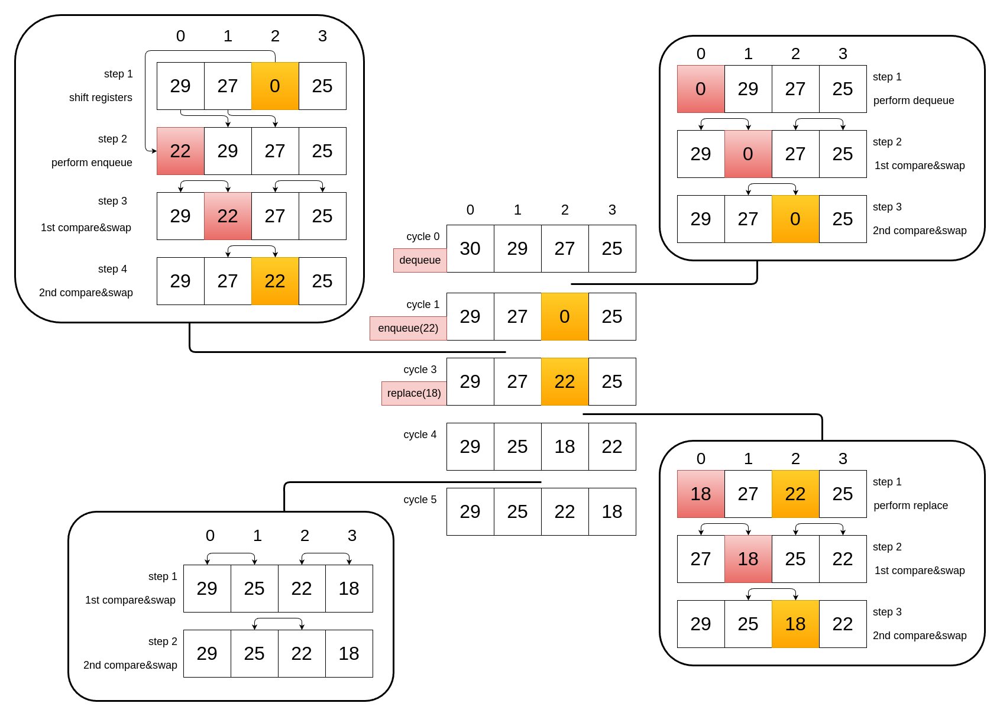
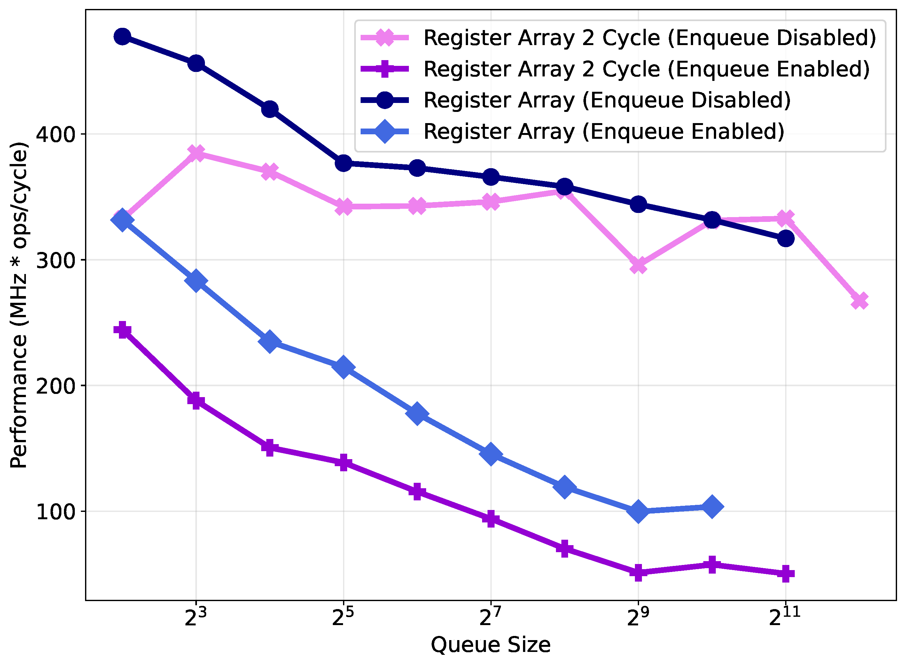

# Register Array Architecture Detail Explaination

## Description

The register array architecture is derived from the register tree, but instead of arranging registers in a hierarchical heap structure, it organizes them in a flat, array-lie layout. The replace operation in this design retains behavioral similarity to that of the register tree. Specifically, during a replace operation, the leftmost entry in the array is overwritten with the new item in a single cycle. This is followed by two phases of array-wide compare-and-swap operations: first, all entries at even indices are compared and potentially swapped with their adjacent odd-indexed neighbors; then, the process is repeated with odd-indexed entries compared and potentially swapped with the adjacent even-indexed entries.

## Dataflow

## Performance comparison against pipelined

