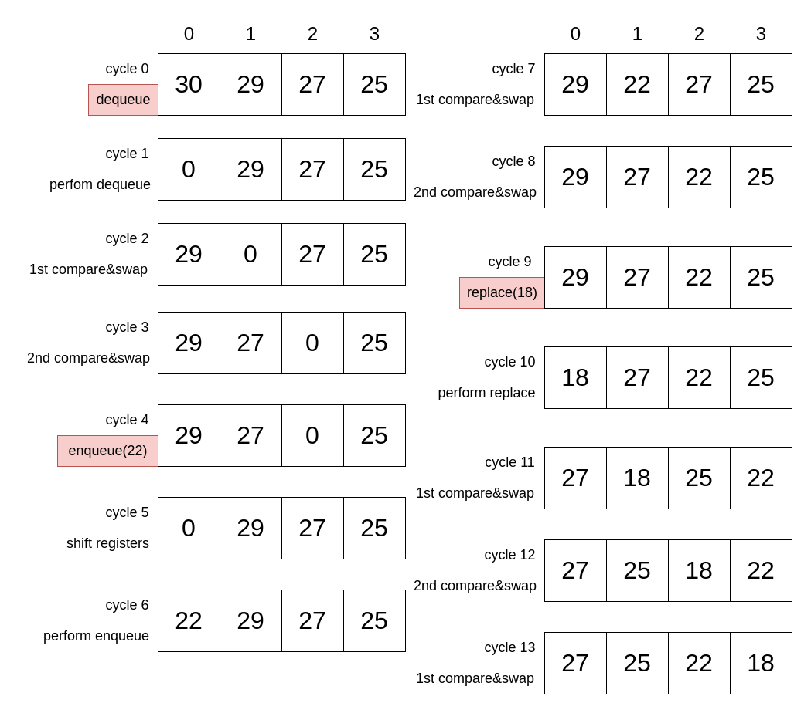

# Register Array (Pipelined)

## Description

The Register Array Pipelined architecture enhances the basic register array priority queue by dividing the compare-and-swap operation across 2 clock cycles. This pipelined approach reduces combinational path lengths by performing only specific comparison pairs in each clock cycle - even-indexed pairs in one cycle and odd-indexed pairs in the next - enabling noticable higher clock frequencies compared to the non-pipelined version.

## Dataflow

## Performance comparison against non-pipelined

