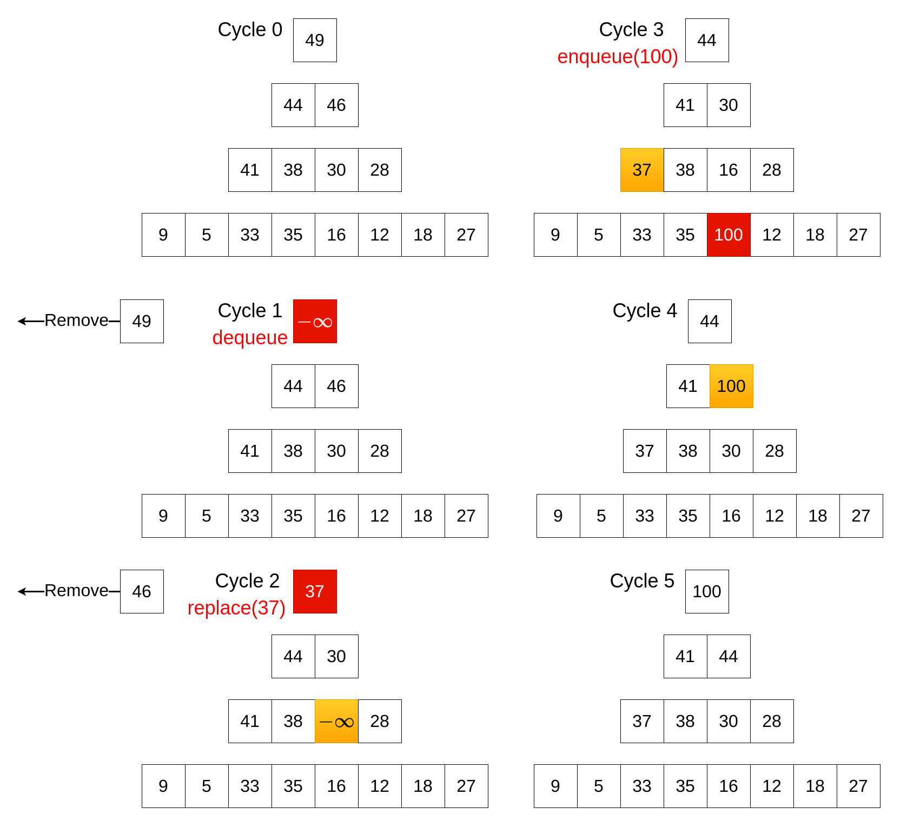
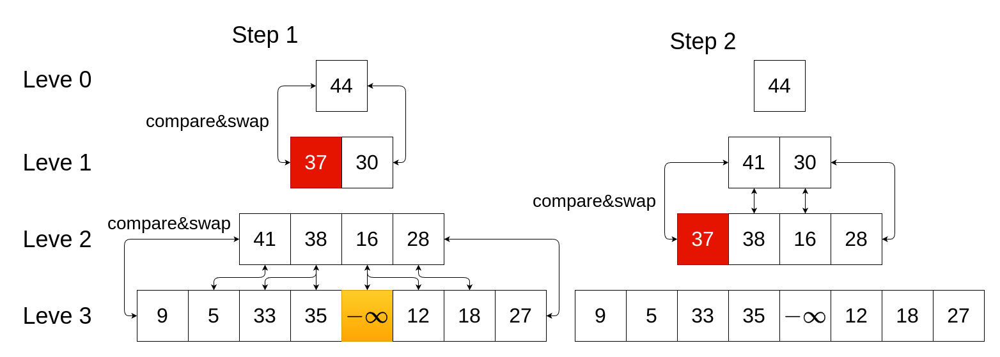
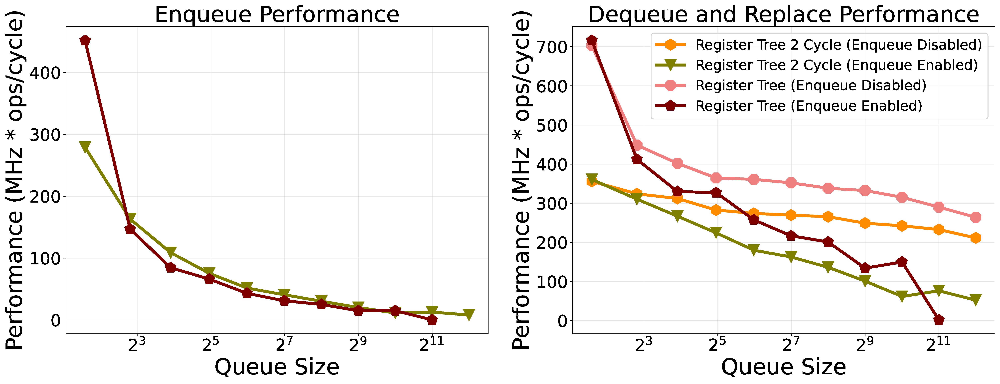

# Register Tree

## Description

Among all hardware architectures, the register tree most closely resembles a software-based priority queue, preserving the heap property to maintain element order.

## Dataflow

We will use a max queue as an example. The min queue would function the same way but with reversed sorting.

During a replace operation, the highest-priority element is removed and returned in a single clock cycle. Concurrently, compare-and-swap operations are performed between nodes on alternating levels of the tree to restore the heap property. The dequeue operation behaves similarly, with the only distinction being that an invalid value is inserted in place of the removed root element.

In contrast, the enqueue operation follows a different procedure. It searches for the leftmost invalid entry and replaces it with the new data. This insertion triggers a reordering process to maintain the heap structure, resulting in a worst-case time complexity of $O(log\ N)$, consistent with its software counterpart.

As illustrated in this figure, both dequeue and replace operations complete in a single cycle, while the enqueue operation requires two cycles to propagate the new entry to its correct position.

A detailed view of the compare-and-swap operation occurring between cycle 2 and cycle 3.

## Performance comparison against pipelined

