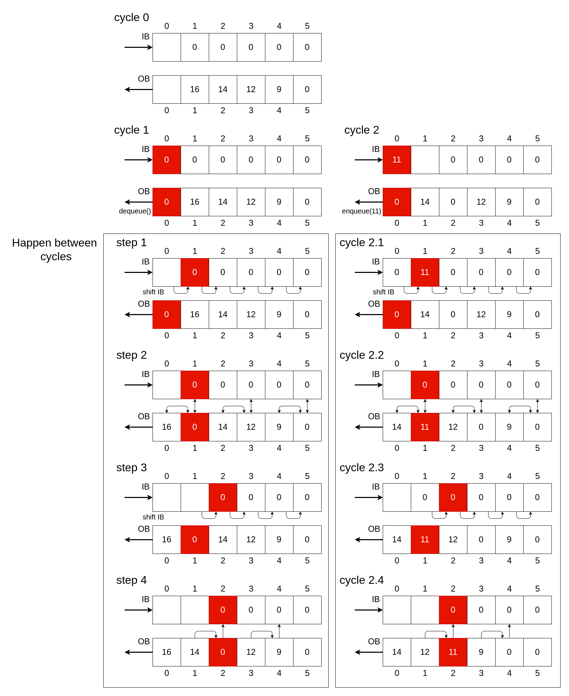

# Systolic Array

## Description

The systolic array architecture consists of two buffers: an input buffer (IB) to store incoming nodes and an output buffer (OB) to hold nodes that are ready for output.

When a new node is inserted into the array, it is first stored in the IB. The sorting mechanism employed in this architecture resembles the bubble sort algorithm. As a new node propagates through the IB and reaches position $IB_i$, it is compared with the node in the subsequent OB position $OB_{i+1}$. If the evaluation function value $f$ of the node in $IB_i$ is smaller than that in $OB_{i+1}$, the two nodes are swapped, and the node previously in $OB_{i+1}$ is passed to the next IB cell, $IB_{i+1}$. This process effectively shifts nodes with higher $f$ values into the IB, preserving order in the OB.

A second case occurs when the head of the OB is dequeued, leaving a "bubble" at position $OB_0$. In response, the corresponding input cell $IB_0$ compares its node with the next OB cell $OB_1$. If the $f$ value of $IB_0$ is lower than that of $OB_1$, the node in $IB_0$ is inserted into $OB_0$. Otherwise, the node from $OB_1$ fills the vacancy, and the bubble propagates one position to the right in the OB.

## Dataflow

